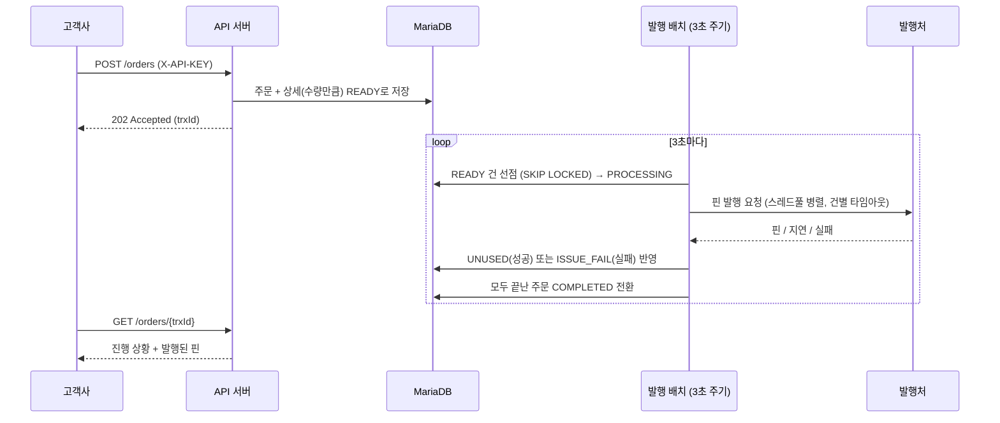
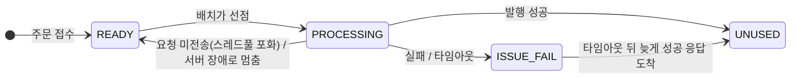

# Coupon API

[](https://github.com/jeonyongwook/coupon-api/actions/workflows/ci.yml)

고객사(B2B)의 주문을 받아 **발행처에서 쿠폰 핀(PIN)을 비동기로 발급받아 전달**하는 쿠폰 발행 API 서버입니다.

주문 접수(동기)와 쿠폰 발행(비동기)을 분리하고, 발행처 응답 지연·타임아웃·중복 요청·서버 다중 실행 같은
**실제 운영에서 문제가 되는 상황을 코드와 테스트로 다룬 것**이 이 프로젝트의 중심입니다.

## 기술 스택

| 구분 | 사용 기술 |
|---|---|
| Language / Framework | Java 17, Spring Boot 3.4 (Web, Data JPA, Validation) |
| DB | MariaDB 10.6+ (운영/로컬), H2 인메모리 (테스트) |
| Build / CI | Gradle, GitHub Actions |
| 문서 | springdoc-openapi (Swagger UI) |
| 테스트 | JUnit 5, AssertJ, MockMvc (통합 테스트 23개) |

## 전체 흐름



> 발행처 연동은 아직 가상(mock)입니다. 0.2~2초의 임의 지연을 주는 `requestPinFromIssuer()`가 실제 발행처 클라이언트를 대신하며,
> 이 자리만 교체하면 나머지 구조(선점·타임아웃·지연 응답 반영)는 그대로 쓸 수 있도록 분리해 두었습니다.

### 상태 전이



주문(`Order`)은 `READY → COMPLETED`이며, **모든 상세의 발행 시도가 끝나면**(성공/실패 무관) COMPLETED가 됩니다.
실패 건 수는 조회 API의 `failedCount`로 확인합니다.

## 핵심 설계 결정

### 1. 멱등한 주문 접수 (`OrderService`, `OrderRegistrar`)
네트워크 재시도로 같은 요청이 두 번 와도 주문이 두 번 만들어지면 안 됩니다.
- 같은 고객사가 같은 `customerTrxId`로 **같은 내용**을 다시 보내면 처음 접수된 `trxId`를 그대로 돌려줍니다.
- **다른 내용**이면 `E003(409)`으로 거절합니다.
- "조회 후 저장" 사이에 동일 요청이 끼어드는 경쟁 상태는 DB 유니크 제약(`customerSeq + customerTrxId`)이 최종 보증합니다.
  제약 위반이 나면 **새 트랜잭션에서 기존 주문을 다시 조회**해 멱등 응답을 줍니다.
  (같은 트랜잭션에서 예외를 잡고 계속하면 rollback-only 상태 때문에 커밋이 실패하므로 `OrderRegistrar`를 별도 빈으로 분리했습니다.)
- 동시 8개 스레드가 같은 요청을 보내도 주문은 1건만 생기는 것을 `OrderServiceTest`로 검증합니다.

### 2. 중복 발행 방지: 선점(claim) 방식 (`CouponIssueClaimer`)
처음에는 `fixedDelay`로 "이전 회차가 끝나기 전에는 다음 회차가 시작되지 않는다"는 사실에 기대고 있었는데,
서버를 2대 이상 띄우면 이 보장이 깨져 같은 건에 핀을 중복 요청하게 됩니다.
- 짧은 트랜잭션에서 `SELECT ... FOR UPDATE SKIP LOCKED`로 READY 건을 잠그고 같은 트랜잭션에서 `PROCESSING`으로 바꿔 커밋합니다.
- 커밋 이후엔 다른 인스턴스·다른 회차의 조회 조건(READY)에 걸리지 않으므로, **발행처 호출처럼 오래 걸리는 구간에는 DB 락을 쥐고 있지 않습니다.**
- 선점한 서버가 죽어 `PROCESSING`으로 멈춘 건은 `STUCK_PROCESSING_SEC`(기본 60초) 뒤에 READY로 복구합니다.

### 3. 발행처 지연 대비: 타임아웃 + 지연 응답 반영 (`CouponIssueBatch`)
- 건별 타임아웃은 "큐에 제출한 시점"이 아니라 **스레드가 실제로 처리를 시작한 시점**부터 계산합니다.
  (제출 시점 기준이면 큐 대기가 긴 건들이 한꺼번에 타임아웃 나는 문제가 생깁니다.)
- `orTimeout()`은 원본 future를 실패로 완료시켜 버려 이후 응답을 받을 방법이 없어지므로,
  원본은 살려 두고 **별도 stage에만** 타임아웃을 겁니다. 타임아웃으로 `ISSUE_FAIL` 처리된 뒤 발행처 응답이 뒤늦게 성공으로 오면 자동으로 `UNUSED`로 반영해 **발급된 핀이 유실되지 않게** 합니다.
- 스레드풀이 포화되어 요청을 아예 보내지 못한 건은 실패가 아니라 READY로 되돌려 다음 회차에 재시도합니다.

### 4. 결과 반영의 상태 전이 가드 (`CouponIssueResultWriter`)
순서가 뒤바뀌어 도착해도 확정된 결과를 뒤집지 않도록 **각 메서드가 스스로 가드**합니다.
이미 `UNUSED`인 건은 실패로 덮어쓰지 않고, 성공이 중복 반영돼도 핀이 바뀌지 않습니다.
호출 순서에 대한 암묵적 가정에 기대지 않는다는 점이 의도입니다.

### 5. 트랜잭션 경계
배치 메서드 전체에 `@Transactional`을 걸지 않습니다. 외부 호출을 기다리는 동안 DB 커넥션을 점유하게 되기 때문입니다.
트랜잭션은 선점(`Claimer`)과 결과 반영(`ResultWriter`)에서만 짧게 쓰며, 같은 클래스 내부 호출은 프록시를 우회하므로 별도 빈으로 분리했습니다.
한 건의 반영 실패가 나머지 건의 반영을 막지 않도록 건별로 예외를 흡수합니다.

### 6. 대량 INSERT 성능
주문 1건에 최대 1,000개의 상세가 생성됩니다. `IDENTITY` 채번은 Hibernate의 insert 배치를 막으므로 `OrderDetail`은
`SEQUENCE(allocationSize=50)`을 쓰고, `hibernate.jdbc.batch_size=50`, `rewriteBatchedStatements=true`를 함께 설정했습니다.
(실측 비교 수치는 아직 측정하지 않았습니다.)

### 7. 보안
- 고객 식별자(`customerKey`)는 본문에 평문으로 오가므로, 별도 시크릿(`X-API-KEY`)을 함께 검증합니다.
- 시크릿은 **SHA-256 해시로만 저장**하고 상수 시간 비교(`MessageDigest.isEqual`)로 검증합니다.
- 존재하지 않는 고객사와 틀린 키를 **같은 401(E010)** 으로 응답해 유효한 고객키를 추측할 수 없게 했습니다.
- 다른 고객사의 주문 조회는 "존재하지 않음"과 같은 404로 응답합니다.

## API

Swagger UI: `http://localhost:8087/swagger-ui.html`

### 주문 접수 — `POST /api/v1/orders`

| 항목 | 설명 |
|---|---|
| Header | `X-API-KEY`: 고객사 시크릿 키 |
| Body | `customerKey`(≤20), `customerTrxId`(≤30, 고객사별 유니크), `customerGoodsCode`(≤30), `quantity`(1~1000), `msgSubject`/`msgAddContent`(선택, ≤100) |
| 성공 | `202 Accepted` |

```bash
curl -i -X POST http://localhost:8087/api/v1/orders \
  -H "Content-Type: application/json" \
  -H "X-API-KEY: demo-secret-key-1234" \
  -d '{"customerKey":"DEMO_CUSTOMER","customerTrxId":"ORDER-0001","customerGoodsCode":"GOODS001","quantity":3}'
```
```json
{ "resCode": "0000", "resMsg": "SUCCESS", "trxId": "TX-3F9A..." }
```

### 주문 조회 — `GET /api/v1/orders/{trxId}?customerKey=...`

```bash
curl -i "http://localhost:8087/api/v1/orders/TX-3F9A...?customerKey=DEMO_CUSTOMER" \
  -H "X-API-KEY: demo-secret-key-1234"
```
```json
{
  "resCode": "0000", "resMsg": "SUCCESS",
  "trxId": "TX-3F9A...", "customerTrxId": "ORDER-0001",
  "status": "COMPLETED", "quantity": 3,
  "issuedCount": 3, "failedCount": 0, "pendingCount": 0,
  "items": [
    { "orderDetailSeq": 1, "status": "UNUSED", "pin": "PIN-1A2B3C4D5E6F",
      "validStartDate": "2026-10-06", "validEndDate": "2026-11-05" }
  ]
}
```

### 에러 코드

| 코드 | HTTP | 의미 |
|---|---|---|
| E001 | 400 | 요청 값 오류 (유효성 검증 실패, 깨진 JSON) |
| E002 | 400 | 존재하지 않거나 판매 중지된 상품 코드 |
| E003 | 409 | 같은 `customerTrxId`로 **다른 내용**의 주문 |
| E004 | 403 | 정지/삭제된 고객사 |
| E005 | 404 | 주문 없음 (타 고객사 주문 포함) |
| E010 | 401 | API 키 누락/불일치, 존재하지 않는 고객사 |
| E009 | 409 | 그 밖의 데이터 충돌 |
| E999 | 500 | 서버 오류 |

## 실행 방법

필요한 것: JDK 17, Docker

```bash
# 1. DB 실행 (MariaDB 10.11)
docker compose up -d

# 2. 서버 실행 (시드 데이터가 자동 생성됩니다)
./gradlew bootRun        # Windows: gradlew.bat bootRun
```

시드 데이터(`app.seed.enabled=true`, 기본값): 고객사 `DEMO_CUSTOMER` / 키 `demo-secret-key-1234` / 상품 코드 `GOODS001`.
운영 환경에서는 `SEED_ENABLED=false`로 끄고, DB 접속 정보는 `DB_URL`, `DB_USERNAME`, `DB_PASSWORD` 환경변수로 주입합니다.

### 배치 설정 (`system_config` 테이블, 그룹 `BATCH_COUPON_ISSUE`)

| 키 | 기본값 | 설명 |
|---|---|---|
| `ISSUE_TRY_COUNT` | 10 | 배치 1회차에 선점할 최대 건수 |
| `ISSUE_TIMEOUT_SEC` | 5 | 발행처 응답 대기 타임아웃(초) |
| `CORE_POOL_SIZE` / `MAX_POOL_SIZE` | 5 / 10 | 발행 스레드풀 크기 (1분마다 재반영, 재시작 불필요) |
| `STUCK_PROCESSING_SEC` | 60 | PROCESSING으로 멈춘 건을 READY로 복구하는 기준 |

> `MAX_POOL_SIZE`는 `ThreadPoolExecutor` 특성상 작업 큐(100)가 가득 찬 뒤에야 쓰입니다.
> 배치가 회차당 `ISSUE_TRY_COUNT`건만 제출하므로 평소 동시 처리량은 `CORE_POOL_SIZE`입니다.

## 테스트

```bash
./gradlew test
```

운영 DB 없이 인메모리 H2(MariaDB 호환 모드)에서 실행되며, 스케줄러는 꺼 두고 테스트가 배치를 직접 호출해 결정적으로 검증합니다.

| 테스트 | 검증 내용 |
|---|---|
| `OrderServiceTest` | 주문 생성, 멱등 재요청, 내용이 다른 중복 거절, 고객사별 거래번호 분리, **동시 요청 시 주문 1건**, 인증/상태/상품 오류 |
| `CouponIssueResultWriterTest` | 지연 성공의 승급, 성공 건 미덮어쓰기, 주문 완료 전환 조건·멱등, 대기 복귀, 멈춘 건 복구 |
| `CouponIssueBatchTest` | 배치 1회 실행으로 전건 발행·주문 완료, 선점 중복 방지, 선점 개수 제한 |
| `OrderApiTest` | 상태 코드(202/400/401/404), 깨진 JSON, 타 고객사 주문 조회 차단 |

## 프로젝트 구조

```
src/main/java/com
├── Main.java
├── common
│   ├── config      # 스레드풀, 스케줄러 on/off, 시드 데이터, system_config 조회
│   ├── entity      # system_config
│   ├── exception   # ErrorCode, CouponApiException, 전역 예외 처리
│   └── security    # API 키 해시/비교
└── couponapi
    ├── controller  # REST API
    ├── service     # 인증, 주문 접수(멱등), 주문 저장(트랜잭션), 주문 조회
    ├── batch       # 선점, 발행(병렬/타임아웃), 결과 반영
    ├── entity      # Order, OrderDetail, Customer, Coupon, Issuer, 상태 enum
    ├── repository
    └── dto
```

## 한계와 다음 단계

- **발행처 연동은 mock**입니다. 실제 연동 시에는 발행처 조회 API로 `ISSUE_FAIL` 건의 실제 발급 여부를 대조(reconciliation)하는 단계가 필요합니다.
- `ISSUE_FAIL` 건의 **자동 재시도 정책**이 없습니다 (재시도 횟수/간격, 최종 실패 알림).
- 스키마는 `ddl-auto=update`로 관리합니다. 운영에서는 Flyway/Liquibase 마이그레이션이 필요합니다.
- 연관 관계를 FK 객체 매핑 대신 ID 값으로 들고 있어 DB 레벨 FK 제약이 없습니다. (대량 배치 처리 시 의도적으로 단순화했으나, 운영에서는 제약 추가를 검토해야 합니다.)
- 부하/동시성 **성능 수치 측정**(배치 insert 효과, 처리량)은 아직 하지 않았습니다.
- 요청 속도 제한(rate limit), 고객사 API 키 발급·재발급 API는 범위 밖입니다.
